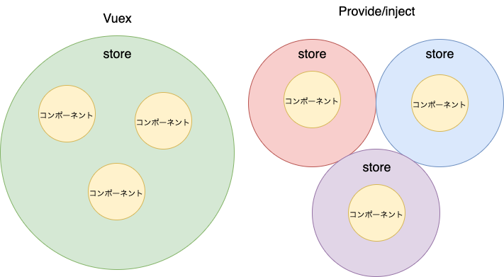

今回はvue3 + typescript + composition-apiで認証を作ってみようと思います。
auth0自体のセットアップ等の説明は省きます。

auth0にはLockとauth0-spa-js主に2つのプラグインがありますが、
それぞれ特徴として以下があります。
- ## Lock
UIをアプリ内に埋め込んで、UIを独自にカスタマイズすることができます。

- ## auth0-spa-js
こちらはリダイレクト先で認証を行う形式になります。

細かいカスタマイズが可能なのはLockですが、今回はauth0-spa-jsを使って認証メソッドを作ります。

vue-cliを使ったvue3プロジェクト上で構築します。

### インストール
まずはじめにauth0-spa-jsを導入します。
vue3はvue-cliを使用して環境を構築しています。

```
npm install @auth0/auth0-spa-js
```

### 環境変数設定
vue-cliだと環境変数にVUE_APPをつけないと正常に認識されないのでちゃんとつけます。

```.env
VUE_APP_AUTH0_DOMAIN=*****.auth0.com // auth0のドメインに書き換える
VUE_APP_AUTH0_CLIENT_ID=aaaaaaaaaaaa // auth0のクライアントIDに書き換える
```

### auth0認証モジュール作成
useAuthという関数を作成し、auth0の認証だけを提供するメソッドを作成します。この後にUserのStoreと連携する部分を作成する流れになります。
まだ、外部に切り出したモジュールについてベストプラクティスがわかってないのですが、外部で使うメソッドはexportする際にcomposition関数であることがわかるようにuseをつけてexportするようにしています。

以下が完成系です。特に難しいことはしていません。useAuthを呼び出した際に、onMountedでauth0クライアントを作成しています。
また、urlのqueryを見てcodeとstateに文字列が入っていた場合にはauth0で認証するために必要な処理を行っています。
ログインした際に戻される先は'/callback'にリダイレクトするようにしているので、auth0の設定のcallback urlも'/callback'に飛ぶようにする必要があります。

auth/index.ts
```js
import createAuth0Client, {
  Auth0Client,
  IdToken,
  RedirectLoginResult
} from "@auth0/auth0-spa-js";
import { reactive, onMounted } from "vue";

interface State {
  loading: boolean;
  isAuthenticated: boolean;
  user: User | null;
  idToken: string;
  popupOpen: boolean;
  error: string | null;
  auth0Client: Auth0Client | null;
}

interface UseAuth {
  useLoginWithRedirect: Function;
  useLogout: Function;
  useIsAuthenticated: Function;
  useInitializeUser: Function;
}

export const useAuth = (): UseAuth => {
  const DOMAIN = process.env.VUE_APP_AUTH0_DOMAIN;
  const CLIENT_ID = process.env.VUE_APP_AUTH0_CLIENT_ID;
  const redirectUri = window.location.origin + "/callback";

  const state = reactive<State>({
    loading: false,
    isAuthenticated: false,
    user: null,
    idToken: "",
    error: null,
    auth0Client: null
  });

  const createClient = async (): Promise<void> => {
    try {
      if (state.auth0Client) return;
      state.auth0Client = await createAuth0Client({
        domain: DOMAIN,
        client_id: CLIENT_ID,
        audience: "",
        redirect_uri: redirectUri
      });
    } catch (e) {
      return e;
    }
  };

  const loginWithRedirect = async () => {
    try {
      if (!state.auth0Client) throw new Error("not created auth0 instance");
      return await state.auth0Client.loginWithRedirect();
    } catch (e) {
      console.log(e);
    }
  };

  const logout = async (): Promise<void> => {
    state.isAuthenticated = false;
    return state.auth0Client?.logout();
  };

  const getIdTokenClaims = async (): Promise<string> => {
    let token: IdToken;
    try {
      if (state.idToken) throw new Error("already exists idToken");
      if (!state.auth0Client) throw new Error("not created auth0 instance");
      token = await state.auth0Client.getIdTokenClaims();
      state.idToken = token.__raw;
      document.cookie = `token=${token.__raw}`;
      return token.__raw;
    } catch (e) {
      console.log(e);
      return e;
    }
  };

  const handleRedirectCallback = async (): Promise<RedirectLoginResult> => {
    try {
      if (!state.auth0Client) throw new Error("not created auth0 instance");
      return await state.auth0Client.handleRedirectCallback();
    } catch (e) {
      return e;
    }
  };

  const getUser = async (): Promise<Auth0User> => {
    try {
      if (!state.auth0Client) throw new Error("not created auth0 instance");
      return await state.auth0Client.getUser();
    } catch (e) {
      return e;
    }
  };

  const isAuthenticated = async (): Promise<boolean> => {
    if (!state.auth0Client) new Error("not created auth0 instance");
    const result = await state.auth0Client?.isAuthenticated();
    if (!result) {
      return false;
    }
    return result;
  };

  const initializeUser = async <T>(): Promise<{
    user: Auth0User;
    token: string;
    isLoggedIn: boolean;
  }> => {
    try {
      await createClient();
      const isAuth = await isAuthenticated();
      if (!isAuth) throw new Error("please login");
      const user: Auth0User = await getUser();
      const token = await getIdTokenClaims();
      const isLoggedIn: boolean = await isAuthenticated();

      return {
        user,
        token,
        isLoggedIn
      };
    } catch (e) {
      return e;
    }
  };

  onMounted(async () => {
    await createClient();
    const query = window.location.search;
    if (query.includes("code=") && query.includes("state=") && !state.loading) {
      await handleRedirectCallback();
      window.location.href = "/";
    }
  });

  return {
    useLoginWithRedirect: loginWithRedirect,
    useLogout: logout,
    useIsAuthenticated: isAuthenticated,
    useInitializeUser: initializeUser
  };
};

```

## Storeを作る

これでひとまずauth0関連の関数をモジュール化できたので、次はuserのstoreをつくります。
storeはvuexを使わず、provide/injectパターンを使ってやっていきます。

まずvuexで状態管理をする場合とprovide/injectで状態管理をする場合の違いをイメージで表してみました。



vuexはvueインスタンス全体で状態を共有します。
そのため、グローバルに共有する必要のない状態まで管理することになります。一元管理することによってstoreディレクトリが肥大化し管理が煩雑になる事が考えられます。

一方、provide/injectパターンでは、トップレベルのコンポーネント毎に状態管理をします。
状態を利用したい場合は、明示的にinjectする必要があるので、状態管理が容易になります。

以下、メモを書いておきます。
### Vuex
1. fluxパターンによって書き方を統一できるので、開発者ごとにコードの差がでにくい
2. vueコンポーネント以外でもstateを使う事ができる。vue-routerファイル等でもimportすれば状態を使える
3. vuex-persistedstate等を使えばstateをlocalstoageで管理することが容易にできる
4. ドキュメントやエラーの回避策が豊富(ネットを調べれば解決策を見つけやすい)
5. 型が効きづらい

### provide/inject
1. 状態のスコープがprovideしたコンポーネント単位になるので、グローバルに持つ必要のない状態を管理しなくてよくなる。
2. 型がきく
3. コードの書き方に決まりがないため、開発者ごとにバラバラなコードを書く事ができるゆえ破綻しやすい。
4. コンポーネント以外で状態を使いたい場合には使えない

やはり現状、ある程度の規模ではvuexは必要かなとは思いますが、ディレクトリごとに小さいストアを作ってバケツリレーを緩和させることもできるので、いい手段かなとは思います。

さて、長くなりましたが、本題にはいります。
今回はstoreディレクトリにuserのストアを作ってルートでprovideしてvuexみたいな使い方をしたいとおもいます。

store/userStore.ts
```js
import { reactive, InjectionKey, inject, computed, ComputedRef } from "vue";

import { useAuth } from "@/auth";

export const UserKey: InjectionKey<UserStore> = Symbol("User");

interface State {
  loading: boolean;
  isAuthenticated: boolean;
  user: User | null;
  accessToken: string;
  popupOpen: boolean;
  error: string | null;
}

interface UseUser {
  useLogin: Function;
  useLogout: Function;
  useInitializeUser: Function;
  user: ComputedRef<User | null>;
  isAuthenticated: ComputedRef<boolean>;
}

export const useUser = (): UseUser => {
  const { useLoginWithRedirect, useLogout, useInitializeUser } = useAuth();

  const state = reactive<State>({
    loading: false,
    isAuthenticated: false,
    user: null,
    accessToken: "",
    popupOpen: false,
    error: null
  });

  const user = computed(() => state.user);
  const isAuthenticated = computed(() => state.isAuthenticated);

  const login = async () => {
    await useLoginWithRedirect();
  };

  const logout = async () => {
    await useLogout();
  };

  const setUser = (payload: {
    user: User;
    isLoggedIn: boolean;
    token: string;
  }) => {
    state.user = payload.user;
    state.isAuthenticated = payload.isLoggedIn;
    state.accessToken = payload.token;
  };

  const initializeUser = async (): Promise<void> => {
    try {
      if (!state.user) new Error("Please Login");
      const result = await useInitializeUser();
      if (!result) new Error("Please Login");
      setUser(result);
    } catch (e) {
      console.log(e);
      return e;
    }
  };

  return {
    useLogin: login,
    useLogout: logout,
    useInitializeUser: initializeUser,
    user,
    isAuthenticated
  };
};

export type UserStore = ReturnType<typeof useUser>;

export const useUserStore = () => {
  const store = inject(UserKey) as UserStore;
  if (!store) {
    throw new Error("useUserStore() is called without provider.");
  }
  return store;
};
```
先ほど作ったuseAuthをimportし、各メソッドで使用しています。またUserKeyを定義し、この値を使用してprovideとinjectを行います。
useUserStoreメソッドを作ることによって、コンポーネントでstoreを利生する場合にimportする物が減るので管理が楽になります。

このuseUserをvueインスタンスを作成する場所でprovideしていきます。

main.ts
```js
import { createApp } from "vue";
import App from "./App.vue";
import router from "./router";
import store from "./store";
import { useUser, UserKey } from "@/store/UserStore";

createApp(App)
  .use(store)
  .use(router)
  .provide(UserKey, useUser())
  .mount("#app");
```

createAppにメソッドチェーンしていくことができます。provide()を使ってUserKeyとuseUserをprovideします。
これでどのコンポーネントでもinjectすればuseUserメソッドが使用できるようになりました。

試しに適当なコンポーネントで作成したstoreの状態を利用してみます。

components/HelloWorld.vue

```vue
<template>
  <div class="hello">
    {{ user }}
    <h3 v-if="!isAuthenticated" @click="useLogin()">ログイン</h3>
    <h3 v-if="isAuthenticated" @click="useLogout()">ログアウト</h3>
    <router-link to="/about">about</router-link>
  </div>
</template>

<script lang="ts">
import { defineComponent } from "vue";
import { useUserStore } from "@/store/UserStore.ts";

export default defineComponent({
  name: "HelloWorld",
  props: {
    msg: String
  },
  setup(props, context) {
    const { useLogin, useLogout, user, isAuthenticated } = useUserStore();
    return {
      useLogin,
      useLogout,
      user,
      isAuthenticated
    };
  }
});
</script>

<style scoped lang="scss">
h3 {
  margin: 40px 0 0;
}
ul {
  list-style-type: none;
  padding: 0;
}
li {
  display: inline-block;
  margin: 0 10px;
}
a {
  color: #42b983;
}
</style>
```

コンポーネント内ではuseUserStoreを使ってinjectします。
setup内では明示的にreturnする必要があるのでちゃんとreturnします。
これでログインをクリックするとauth0の認証画面に遷移し、認証が完了すると、/callbackに戻ってきます。※auth0の設定で明示的にcallback URLを設定する必要があります。

callbackコンポーネントではtokenやユーザー情報の取得等を行います。

views/callback.vue
```vue
<template>
  <div id="callback">
    ログイン中...
  </div>
</template>

<script lang="ts">
import { defineComponent, onMounted, SetupContext } from "vue";
import { useUser } from "@/store/UserStore.ts";
import { useAuth } from "@/auth/index";

export default defineComponent({
  setup(props, context: SetupContext) {
    useAuth();
  }
});
</script>
<style lang="scss"></style>

```

setup内でuseAuthメソッドを呼ぶことで、uriからtokenを取得したりします。取得できたら/に飛ばし、user storeにuser情報をセットします。

一応 router設定ものせておきます。かなり適当です。

```js
import { createRouter, createWebHistory, RouteRecordRaw } from "vue-router";
import HelloWorld from "@/components/HelloWorld.vue";
import About from "@/views/About.vue";
import Callback from "@/views/Callback.vue";

const routes: Array<RouteRecordRaw> = [
  {
    path: "/",
    name: "HelloWorld",
    component: HelloWorld
  },
  {
    path: "/callback",
    name: "Callback",
    component: Callback
  }
];

const router = createRouter({
  history: createWebHistory(process.env.BASE_URL),
  routes
});

export default router;
```

以上で、一旦vue3を使ってauth0で認証することはできました。
実際に使う場合は、auth0のユーザー情報をそのまま使うケースはすくないと思うので、その辺りの処理を付け足す必要はありそうですので、時間があったら追記します。

フロントエンドが進化していってる中で、state管理は永遠の課題感がありますが、今後ともベストプラクティスを模索し続けたいですね。